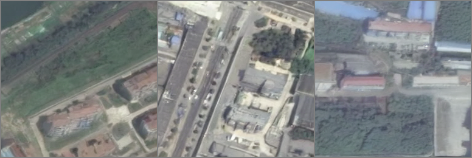
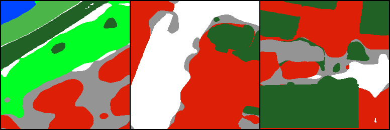

## DreamCD: A change-label-free framework for change detection via a weakly conditional semantic diffusion model in optical VHR imagery

## 📰 News
- **[2026-01-30]** DreamCD has been accepted by the [JAG](https://doi.org/10.1016/j.jag.2026.105125).
- **[2025-11-30]** We have released a synthetic demo for DreamCD. The rest of the code will be released after peer review.

## 🚀Hightlights 

1.	Proposes DreamCD, a change-label-free framework for VHR imagery.
2.	Employs a weakly semantic conditional diffusion model using pseudo-semantic masks.
3.	Incorporates bi-temporal style differences into change image synthesis.
4.	Introduces a large-scale semantic change detection dataset, LsSCD-Ex.
5.	Achieves state-of-the-art unsupervised accuracy on SECOND and LsSCD-Ex datasets.

## 📚LsSCD-Ex dataset download link
[[Download link]](https://doi.org/10.5281/zenodo.17765755) 
**Note**: If you need the original, uncropped large-scale TIFF imagery, please contact us (tangkai@mail.bnu.edu.cn) to obtain the download link.
<div align="center">
  
</div>

## 📦Getting Started

### Step.1 Installation

```bash
git clone https://github.com/tangkai-RS/DreamCD.git
conda create -n dreamcd python=3.8.5 -y
cd dreamcd
pip install -r requirement.txt
```

### Step.2 Download pre-trained checkpoints

[[Download link]](https://huggingface.co/tangkaii/DreamCD)

After downloading the checkpoints of diffusion models and placing it in the folder `./checkpoints/`, please follow the directory structure below:  

```
checkpoints  
|-- lsscd  
|   |-- vqvae.ckpt             
|   |-- ldm.ckpt               
|-- second  
|   |-- vqvae.ckpt             
|   |-- ldm.ckpt  
```

### Step.3 Synthesize post-event images

- **For LsSCD-Ex dataset**
```bash
python changeanywhere2_synthesis.py \
    --config_path "configs/synthesis-wcsdm-lsscd.yaml" \
    --ckpt_path "checkpoints/lsscd/ldm.ckpt" \
    --preview_path "preview/example_lsscd" \
    --data_csv "example/lsscd/sample_list.txt"
```

- **For SECOND dataset**
```bash
python changeanywhere2_synthesis.py \
    --config_path "configs/synthesis-wcsdm-second.yaml" \
    --ckpt_path "checkpoints/second/ldm.ckpt" \
    --preview_path "preview/example_second" \
    --data_csv "example/second/sample_list.txt"
```

Folder ```preview``` lets you quickly browse results.

<div align="center">
  
</div>

<div align="center">
  
</div>

<div align="center">
  
</div>

## Citation
```bibtex
@article{tang2026dreamcd,
  title   = {DreamCD: A Change-Label-Free Framework for Change Detection via a Weakly Conditional Semantic Diffusion Model in Optical VHR Imagery},
  author  = {Tang, Kai and Zheng, Zhuo and Chen, Hongruixuan and Chen, Xuehong and Chen, Jin},
  journal = {International Journal of Applied Earth Observation and Geoinformation},
  volume  = {146},
  pages   = {105125},
  year    = {2026},
  issn    = {1569-8432},
  doi     = {10.1016/j.jag.2026.105125},
}
```
